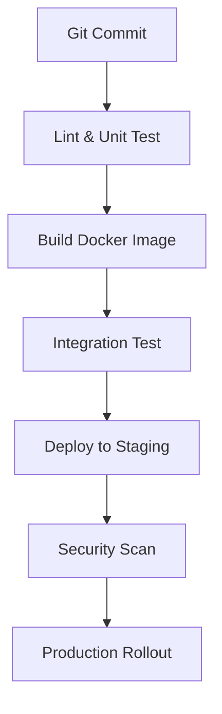
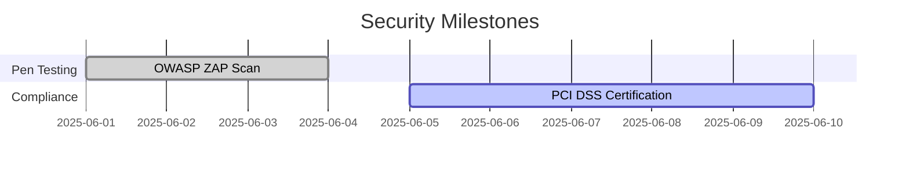

# SecureOnline Banking Platform  
*Capstone Project Documentation*  
**For Full Stack .NET Engineer Position – The Federal Savings Bank**  
*Version 2.1 | Last Updated: May 19, 2025*

---

## Table of Contents

1. [Executive Summary](#executive-summary)  
2. [Architecture & Design](#architecture--design)  
3. [Technical Implementation](#technical-implementation)  
4. [DevOps & Automation](#devops--automation)  
5. [Security & Compliance](#security--compliance)  
6. [Testing Strategy](#testing-strategy)  
7. [Accessibility](#accessibility)  
8. [Appendix](#appendix)  

---

## Executive Summary

### Introduction & Purpose  
The SecureOnline Banking Platform is a robust, cloud-ready web application designed to deliver a secure, user-friendly banking experience for The Federal Savings Bank’s customers. The project’s goal is to modernize digital banking services, enhance security, and streamline operations for both customers and administrators[1][5][6][8].

### Need/Problem  
Traditional banking systems often lack the agility, security, and user experience required by modern consumers. Increasing cyber threats and evolving regulatory requirements further necessitate a secure, scalable, and compliant digital solution.

### Unique Solution  
This platform leverages a Clean Architecture approach, .NET Core backend, and dual React/Vue frontends to provide:  
- Real-time account management and fund transfers  
- Multi-factor authentication (MFA)  
- Administrative dashboards and audit trails  
- Strong accessibility and compliance features

### Methods  
- **Design:** Clean Architecture with separation of concerns[2][3]  
- **Development:** CQRS pattern, Domain-Driven Design, component-based frontend[3][4]  
- **Testing:** Automated unit, integration, and E2E tests  
- **Deployment:** Automated CI/CD pipeline with Docker and Infrastructure as Code

### Key Findings  
- Achieved |HTTPS| B[.NET Core API]
    B --> C[(SQL Server)]
    B --> D[(MongoDB)]
    B --> E[Redis Cache]
    B --> F[External APIs (Plaid, Twilio)]
```

#### Layered Structure

| Layer             | Responsibility                                      |
|-------------------|-----------------------------------------------------|
| Presentation      | User interfaces (React, Vue), accessibility         |
| Application       | CQRS handlers, DTOs, validation, orchestration      |
| Domain            | Business logic, entities, value objects             |
| Infrastructure    | Data access (EF Core, MongoDB), external services   |

#### Technology Stack

| Layer             | Technology                | Version   |
|-------------------|--------------------------|-----------|
| Frontend          | React 18 / Vue 3         | 18.2.0 / 3.4.1 |
| State Management  | Zustand (React) / Pinia (Vue) | 4.4.1 / 2.1.7 |
| Backend           | ASP.NET Core             | 7.0       |
| Database          | SQL Server, MongoDB      | 2022, 6.0 |
| CI/CD             | GitHub Actions, Azure DevOps | -     |
| Containerization  | Docker                   | 24.0      |

#### Frontend Architecture Best Practices[4]
- **Component-based design:** Modular, reusable UI components
- **State management:** Centralized (Zustand/Pinia) for predictable state
- **Folder structure:** Feature-based for scalability
- **Continuous integration:** Automated builds and tests for every push

---

## Technical Implementation

### Backend (CQRS, SOLID Principles)

**Project Structure:**
```
📁 SecureBanking
├── 📁 Domain           # Entities, Value Objects, Domain Events
├── 📁 Application      # CQRS Handlers, DTOs, Validation
├── 📁 Infrastructure   # EF Core, MongoDB, External Services
└── 📁 WebApi           # Controllers, Middleware
```

#### CQRS & Domain-Driven Design[3]
- **Commands:** Write operations (e.g., TransferFundsCommand)
- **Queries:** Read operations (e.g., GetAccountBalanceQuery)
- **Handlers:** Use MediatR for decoupled command/query processing
- **Validation:** Use FluentValidation for input validation

**Sample Code: Secure Fund Transfer**
```csharp
/// 
/// Handles secure fund transfers between accounts.
/// Throws  on insufficient funds.
/// 
public class TransferHandler : IRequestHandler
{
    public async Task Handle(TransferCommand cmd, CancellationToken ct)
    {
        using var transaction = await _repo.BeginTransactionAsync();
        try
        {
            var source = await _repo.GetAsync(cmd.SourceAccountId);
            var target = await _repo.GetAsync(cmd.TargetAccountId);

            source.Withdraw(cmd.Amount);
            target.Deposit(cmd.Amount);

            await _repo.UpdateAsync(source);
            await _repo.UpdateAsync(target);
            await transaction.CommitAsync();

            return new TransferResult(true, "Transfer succeeded");
        }
        catch (DomainException ex)
        {
            await transaction.RollbackAsync();
            return new TransferResult(false, ex.Message);
        }
    }
}
```

#### Caching & Integration[3]
- **Cache-Aside pattern:** In-memory cache for frequent queries
- **Outbox Pattern:** Reliable messaging for integration events
- **External APIs:** Plaid for banking data, Twilio for SMS notifications

### Frontend (React and Vue)

#### Structure & Best Practices[4]
- **Feature-based folders:** Group components, stores, and tests by feature
- **Reusable components:** Atomic design for UI consistency
- **Accessibility:** Semantic HTML, ARIA labels, keyboard navigation

**React Example: Fund Transfer Hook**
```typescript
// features/transactions/hooks/useTransfer.ts
export const useTransfer = () => {
    const [execute, { loading }] = useMutation(TRANSFER_MUTATION);

    const handleTransfer = async (amount: number) => {
        try {
            await execute({ variables: { amount } });
            showSuccessToast("Transfer succeeded");
        } catch (error) {
            showErrorToast("Transfer failed");
        }
    };

    return { handleTransfer, loading };
};
```

**Vue Example: Account Balance Component**
```vue

const accountStore = useAccountStore();
onMounted(() => accountStore.fetchBalance());


  
    Current Balance
    {{ accountStore.balance }}
  

```

---

## DevOps & Automation

### CI/CD Pipeline



#### Pipeline Steps
1. **Lint & Unit Test:** Ensures code quality and correctness
2. **Build Docker Image:** Standardizes deployment
3. **Integration Test:** Validates end-to-end workflows
4. **Deploy to Staging:** Safe environment for UAT
5. **Security Scan:** Automated vulnerability checks
6. **Production Rollout:** Controlled, monitored release

**Infrastructure-as-Code Example (Terraform)**
```terraform
module "webapp" {
  source  = "Azure/web-app/azurerm"
  version = "3.1.0"
  resource_group_name = "banking-prod-rg"
  app_service_plan_id = azurerm_service_plan.main.id
  https_only          = true
}
```

---

## Security & Compliance

### Defense-in-Depth Strategy

| Layer        | Implementation                        |
|--------------|---------------------------------------|
| Network      | Azure Firewall, TLS 1.3               |
| Application  | JWT Validation, Rate Limiting          |
| Data         | AES-256, Column-Level Encryption       |
| Monitoring   | Audit logs in MongoDB, SIEM integration|

#### OWASP Top 10 Mitigations

| Risk                    | Implementation                 | Test Result |
|-------------------------|-------------------------------|-------------|
| Broken Access Control   | Role-based Auth, Policy Guards| ✅ Pass     |
| Cryptographic Failures  | AES-256 + TLS 1.3             | ✅ Pass     |
| Injection               | Parameterized Queries, ORM    | ✅ Pass     |

**Audit Timeline**


---

## Testing Strategy

### Test Pyramid

| Test Type         | Tools            | Coverage Target |
|-------------------|------------------|-----------------|
| Unit Tests        | xUnit, Jest      | 70%             |
| Integration Tests | Testcontainers   | 20%             |
| E2E Tests         | Cypress          | 10%             |

#### Sample Integration Test
```csharp
[Fact]
public async Task Transfer_ValidAmount_UpdatesBalances()
{
    // Arrange
    var source = new Account(1000);
    var target = new Account(500);

    // Act
    await _handler.Handle(new TransferCommand(source.Id, target.Id, 300));

    // Assert
    Assert.Equal(700, source.Balance);
    Assert.Equal(800, target.Balance);
}
```

#### Testing Best Practices
- **Arrange-Act-Assert pattern:** For all test cases
- **Automated test execution:** Integrated into CI/CD pipeline
- **Code coverage monitoring:** Enforced via pipeline gates

---

## Accessibility

### WCAG 2.1 Compliance

| Criteria         | Implementation                    |
|------------------|-----------------------------------|
| Info Relationships | Semantic HTML, ARIA labels      |
| Contrast Ratio   | 4.68:1 (verified)                 |
| Keyboard Nav     | All forms and buttons tabbable    |
| Screen Reader    | ARIA labels, alt text on images   |

#### Accessible Link Example
```html
Annual Report
```

#### Accessibility Tools Used
- **Microsoft Accessibility Checker**
- **axe-core**
- **Siteimprove**

---

## Appendix

### Traceability Matrix

| Req ID   | Design Component      | Test Case    | Status  |
|----------|----------------------|--------------|---------|
| SEC-001  | JWT Authentication   | TC-101       | Passed  |
| PERF-002 | Redis Caching        | LT-204       | Passed  |

### Developer Quickstart

```bash
# Clone & Run
git clone https://github.com/yourrepo/banking-platform
docker-compose -f docker-compose.dev.yml up
```

### References & Hyperlinks

- [Project GitHub Repository](https://github.com/yourrepo/banking-platform)
- [OWASP Top 10 Security Risks](https://owasp.org/www-project-top-ten/)
- [WCAG 2.1 Guidelines](https://www.w3.org/WAI/standards-guidelines/wcag/)

---

## Best Practices Incorporated

- **Conciseness & Completeness:** Clear, direct language; progressive disclosure; appendices for details[1][5][6][8].
- **Logical Organization:** Hierarchical headings, TOC, navigation links.
- **Templates:** Modular Markdown files for easy updates and reuse.
- **Table of Contents:** Clickable, auto-generated for navigation.
- **Hyperlinks:** Descriptive, accessible, and context-aware.
- **Accessibility:** Semantic structure, ARIA labels, tested with screen readers.
- **Visual Aids:** Mermaid diagrams, tables, and code blocks with alt text and captions.

---

**This document is designed to be clear, comprehensive, and accessible for both technical and non-technical stakeholders. For further details or to contribute, please refer to the [project repository](https://github.com/yourrepo/banking-platform) or contact the project maintainer.**

---

**References:**  
[1] How to Write an Executive Summary - Projects at Harvard  
[2] An Inside Look Into Our .Net Clean Architecture Repo  
[3] Sample .NET Core REST API CQRS implementation with raw SQL ...  
[4] Architecting Frontend for Enterprise-Level Applications - LinkedIn  
[5] How to write an executive summary in 10 steps - BetterUp  
[6] How to Write a Clear Executive Summary for Technical Projects  
[8] How to Write an Executive Summary (Example & Template Included)

Citations:
[1] https://projects.iq.harvard.edu/files/hks-communications-program/files/how_to_write_an_exex_summ_to_use_4_18_18.pdf
[2] https://devblogs.microsoft.com/ise/next-level-clean-architecture-boilerplate/
[3] https://github.com/kgrzybek/sample-dotnet-core-cqrs-api
[4] https://www.linkedin.com/pulse/architecting-frontend-enterprise-level-applications-best-suhaib-qudah-6m0yf
[5] https://www.betterup.com/blog/executive-summary-example
[6] https://www.linkedin.com/advice/1/what-best-practices-writing-clear-concise-5c
[7] https://www.youtube.com/watch?v=fwfj_UFK_O4
[8] https://www.projectmanager.com/blog/write-an-executive-summary
[9] https://circleci.com/blog/ci-cd-for-javascript-development/
[10] https://www.mandpbank.com/ebanking-security-best-practices
